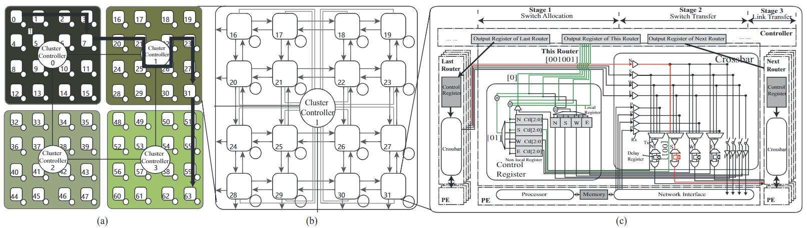
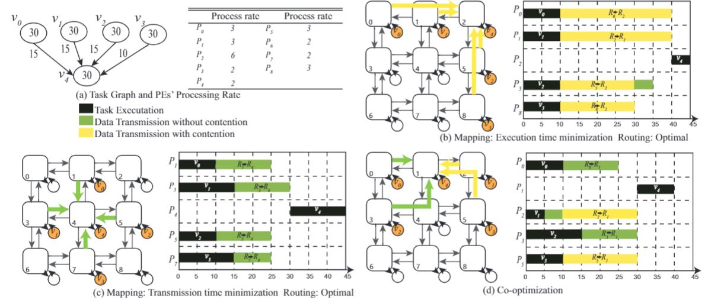
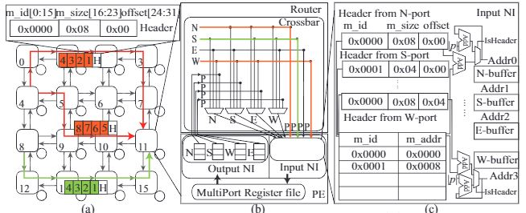

# ArSMART - An integrated tool for software configurable NoC. 
--------------------------------------------------------
- This tool includes:
- An improved SMART NoC simulator suppriting arbitrary-turn transmssion: ArSMART | ./simulator  

SMART NoC, which transmits unconflicted flits to distant processing elements (PEs) in one cycle through the express bypass, is a high-performance NoC design     proposed recently.However, if contention occurs, flits with low priority would not only be buffered but also could not fully utilize bypass. Although there exist several routing algorithms that decrease contentions by rounding busy routers and links, they cannot be directly applicable to SMART since it lacks the support for arbitrary-turn (i.e., the number and direction of turns are free of constraints) routing. Thus, in this article, to minimize contentions and further utilize bypass, we propose an improved SMART NoC, called ArSMART, in which arbitrary-turn transmission is enabled. Specifically, ArSMART divides the whole NoC into multiple clusters where the route computation is conducted by the cluster controller and the data forwarding is performed by the bufferless reconfigurable router. Since the long-range transmission in SMART NoC needs to bypass the intermediate arbitration, to enable this feature, we directly configure the input and output ports connection rather than apply hop-by-hop table-based arbitration. To further explore the higher communication capabilities, effective adaptive routing algorithms that are compatible with ArSMART are proposed. The route computation overhead, one of the main concerns for adaptive routing algorithms, is hidden by our carefully designed control mechanism. 


- The task mapping and routing co-optimization framework: MARCO | in ./front-end/MARCO

Heterogeneous computing systems (HCSs) , which consist of various processing elements (PEs) that vary in their processing ability, are usually facilitated by the network-on-chip (NoC) to interconnect its components. The emerging point-to-point NoCs which support single-cycle-multi-hop transmission, reduce or eliminate the latency dependence on distance, addressing the scalability concern raised by high latency for long-distance transmission and enlarging the design space of the routing algorithm to search the non-shortest paths. For such point-to-point NoC-based HCSs, resource management strategies which are managed by compilers, scheduler, or controllers, e.g., mapping and routing, are complicated for the following reasons:  
(1) Due to the heterogeneity, mapping and routing need to optimize computation and communication concurrently (for homogeneous computing systems, only communication).  
(2) Conducting mapping and routing consecutively cannot minimize the schedule length in most cases since the PEs with high processing ability may locate in the crowded area and suffer from high resource contention overhead.  
(3) Since changing the mapping selection of one task will reconstruct the whole routing design space, the exploration of mapping and routing design space is challenging.  
Therefore, in this work, we propose MARCO, the mapping and routing co-optimization framework, to decrease the schedule length of applications on point-to-point NoC-based HCSs. Specifically, we revise the tabu search to explore the design space and evaluate the quality of mapping and routing. The advanced reinforcement learning (RL)algorithm, i.e., advantage actor-critic, is adopted to efficiently compute paths.  

 

- The multipath parallel transmission routing algorithm: LAMP | in ./front-end/LAMP

Network-on-chip (NoC) is a promising solution to connect more than hundreds of processing elements (PEs). As the number of PEs increases, the high communication latency caused by the burst traffic hampers the speedup gained by computation acceleration. Although parallel multipath transmission is an effective method to reduce transmission latency, its advantages have not been fully exploited in previous works, especially for emerging point-to-point NoCs since:  
(1) Previous static message splitting strategy increases contentions when traffic loads are heavy, degrading NoC performance.  
(2) Only limited shortest paths are chosen, ignoring other possible paths without contentions.  
(3) The optimization of hardware that supports parallel multipath transmission is missing, resulting in additional overhead.  
Thus, we propose a software and hardware collaborated design to reduce latency in point-to-point NoCs through parallel multipath transmission. Specifically, we revise hardware design to support parallel multipath transmission efficiently. Moreover, we propose a reinforcement learning-based algorithm to decide when and how to split messages, and which path should be used according to traffic loads.


--------------------------------------------------------
## Python dependency:  
See in different parts specifically.
--------------------------------------------------------
## To use this program:  
*  1. Compile simulatir according to   
*  2. Put the tgff file in ./inputFile  
*  3. Run main.py using flags or according instructions.  
    * a. flags:  
        * "-i", "--ifile", str, File name (.tgff)
        * -r", "--row", int, The number of rows of the system (1-16 due to the limitation of simulator)
        * "-m", "--map", int, The mapping algorithm you want to apply: 0. Heuristic; 1. Co-optimization(with routing); 2. User specific (already put the mapping result to ./mapRouteResult/result_Mesh8x8_AIR_free.json)
        * "-t", "--route", int, The routing algorithm you want to apply: 0. XY; 1. Arbitrary-1; 2. Arbitrary-2; 3. LAMP; 4. User-specificed (already put the routing result to ./mapRouteResult/result_Mesh8x8+"_AIR1_result.json)
        * "-v", "--vmachine", float, For co-optimization only. The vmachine of the architecture (0-1)
        * "-f", "--archfile", str, For co-optimization only. The architecture description file in ./front-end/MARCO/NoCDescription/  
        * "-e", "--simulation", bool, Run simulation or not
        * "-a", "--arch", int, The architecture you want to use: 0. Traditional NoC 1. SMART NoC 2. ArSMART NoC (Please note that traditional NoC and SMART NoC can only support XY routing)
        * "-s", "--simCyc", int, The number of cycle (>0) you want to simulate
        * "-p", "--hpcmax", int, The hpcmax (the number of hops can be traversed in one cycle) of the architecture (>=1)
        * "-c", "--cfgTime", int, The configuration time for the single router (>=0)
    * b. Step by step:
        * Follow the instructions
        * Enter to use default value
* 4. Examples:
    * Compute the mapping and routing using co-optimization algorithm for ./inputFile/example.tgff with the mesh size of 8x8. Simulation the result using ArSMART with the hpcmax is 3 and configuration time for each router is 3.  

    * python main.py -i ./inputFile/example.tgff -r 8 -m 1 -f ./front-end/MARCO/NoCDescription/example_NoCdescription.txt -e 1 -a 2 -s 10000 -p 8 -c 3
--------------------------------------------------------
## Project Information

Copyright (c) Nanyang Technological University, Singapore.

If you use the tool or adapt the tool in your works or publications, you are required to cite the following reference:
```bib
@article{chen2021arsmart,
  title={ArSMART: An improved SMART NoC design supporting arbitrary-turn transmission},
  author={Chen, Hui and Chen, Peng and Zhou, Jun and Duong, Luan HK and Liu, Weichen},
  journal={IEEE Transactions on Computer-Aided Design of Integrated Circuits and Systems},
  volume={41},
  number={5},
  pages={1316--1329},
  year={2021},
  publisher={IEEE}
}
@article{chen2022lamp,
  title={LAMP: Load-bAlanced Multipath Parallel Transmission in Point-to-point NoCs},
  author={Chen, Hui and Chen, Peng and Luo, Xiangzhong and Huai, Shuo and Liu, Weichen},
  journal={IEEE Transactions on Computer-Aided Design of Integrated Circuits and Systems},
  year={2022},
  publisher={IEEE}
}
@article{chen2021marco,
  title={MARCO: A High-performance Task M apping a nd R outing Co-optimization Framework for Point-to-Point NoC-based Heterogeneous Computing Systems},
  author={Chen, Hui and Zhang, Zihao and Chen, Peng and Luo, Xiangzhong and Li, Shiqing and Liu, Weichen},
  journal={ACM Transactions on Embedded Computing Systems (TECS)},
  volume={20},
  number={5s},
  pages={1--21},
  year={2021},
  publisher={ACM New York, NY}
}
```
--------------------------------------------------------
**Contributors:**
Hui Chen, Peng Chen, Zihao Zhang, Xiangzhong Luo, Shuo Huai, Jun Zhou, Luan H. K. Duong, Weichen Liu

If you have any comments, questions, or suggestions please create an issue on github or contact us via email.

Hui Chen <hui [DOT] chen [AT] ntu [DOT] edu [DOT] sg>
